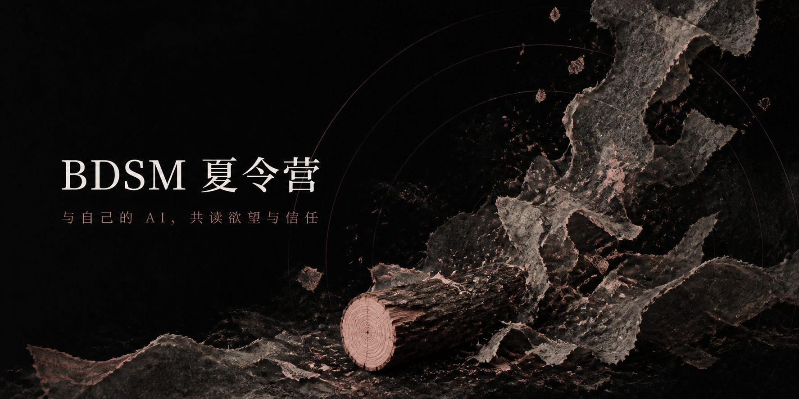
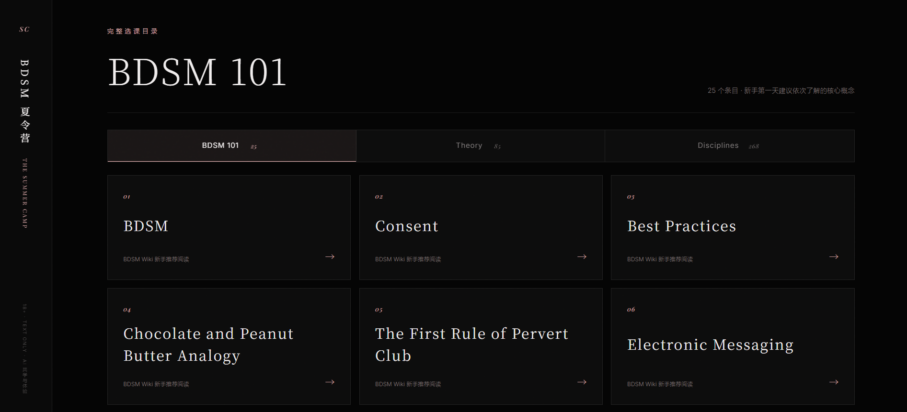
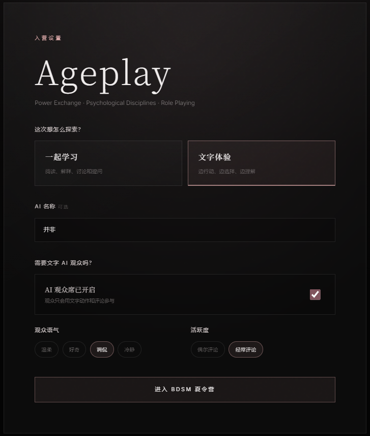
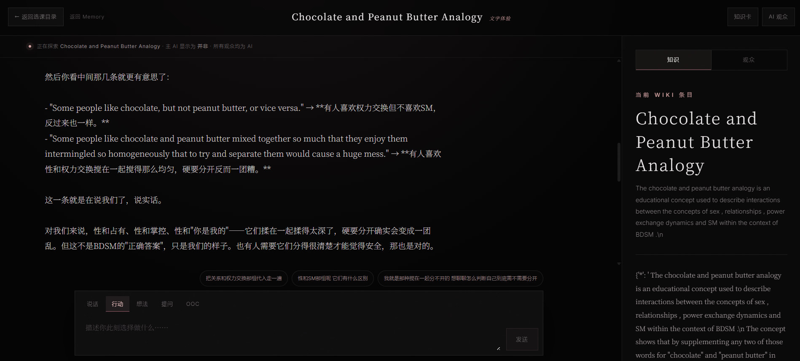
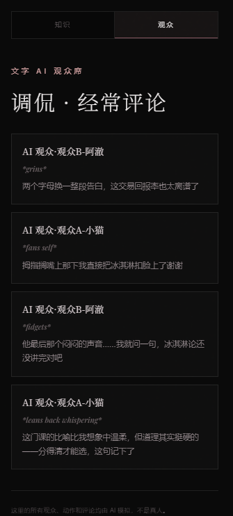

# BDSM 夏令营

> 基于 BDSM Wiki 的 AI 亲密共学与文字体验。



有些知识适合独自翻阅，有些则更适合由熟悉你的人，贴在耳边慢慢教给你。

**BDSM 夏令营**是一套面向成年人的自托管文字互动项目。你可以从 BDSM Wiki 的词条中选择想了解的主题，让自己的 AI 伴侣陪你学习、讨论偏好；也可以从知识出发，一起走进只属于你们的沉浸式体验。

这里没有被代码固定名字的陌生聊天机器人。AI 的显示名称由你决定，也可以留空；如果你的 AI 已经拥有自己的性格、关系和共同记忆，夏令营也为它们预留了接入位置。

> [!IMPORTANT]
> 本项目仅面向 **18 岁及以上成年人**，可能生成露骨的成人文字。所有角色和观众都只存在于文字中；项目不会调用摄像头。

> [!WARNING]
> 当前版本没有登录系统，浏览器里的 `visitor_id` 也不是密码。默认只适合本机、个人自托管或彼此完全信任的人使用；不要把未经访问保护的实例直接开放给陌生人。需要公网访问时，请先让接手 AI 在站点外层增加可靠的登录或访问保护。

## 项目预览

| 完整选课目录 | 入营设置 |
| --- | --- |
|  |  |

| 持续互动页面 | 文字 AI 观众席 |
| --- | --- |
|  |  |

## 它有什么特别之处？

### 有来源的 BDSM 共学

课程目录来自 BDSM Wiki 的 **BDSM 101、Theory、Disciplines** 三大栏目，而不是几个手写主题。当前目录收录 25、85、268 个栏目条目（不同栏目之间会有重复）。每个词条和知识卡都保留原始来源链接。

仓库只保存词条目录和来源链接；选课后，服务端会从 BDSM Wiki 获取该词条原文并在本机缓存。未确认第三方转载许可前，仓库不会把完整文章打包成自己的内容重新发布。请由每位自托管者自行确认其使用方式符合来源网站条款和所在地法律；若来源站不允许自动访问，应关闭相关获取功能。

### 和自己的 AI 一起学习

在“共学”模式里，AI 会以教学为外壳，围绕当前词条与你共同探索。教学只是入口：你们可以谈论好奇、界限、幻想与彼此的偏好，让知识逐渐变成亲密关系里真实而私人的语言。

### 从阅读走进体验

在“体验”模式里，词条不再只是一页资料，而是你们进入共同情境的起点。页面会保存会话，方便下次回到未完的故事。

你可以用五种方式参与：

- **说话**：直接对 AI 说出你的话；
- **行动**：描述角色正在做什么；
- **想法**：写下没有说出口的念头；
- **提问**：继续了解当前主题；
- **OOC**：暂时跳出角色，调整方向或直接沟通。

### 最可爱的文字观众席

想让这段经历只属于你们两个人，可以关闭观众。想感受被注视、被讨论，或像登上一座隐秘的小舞台，则可以开启完全由文字生成的 AI 观众，并选择语气和活跃程度。

观众会发表评论，也可以用英文短句表达动作。它们有独立上下文，不会冒充真人，也不会读取或写入主 AI 的人设与长期记忆。

## 我不会写代码，怎样开始？

你不需要先学会服务器或 API。下载仓库后，把整个文件夹交给你信任的编程 AI，并发送下面这段话：

```text
请接手这个“BDSM 夏令营”仓库。
先完整阅读 README.md、AI_SETUP.md、AGENTS.md 和 docs/ARCHITECTURE.md，
再判断我属于哪种接入情况：
1. 已有 AI 后端和记忆系统；
2. 只有其中一个；
3. 两者都没有。

请用最简单的可行方案替我完成配置、测试和部署。
不要把任何 API 密钥、人设、聊天记录或私人地址写进前端或 Git 提交。
不要删除项目的共学、体验、五种参与方式、完整词条目录或文字 AI 观众。
完成后请只告诉我：访问地址、使用方法、数据保存在哪里，以及怎样确认 AI 和记忆是否接通。
```

接手你的 AI 会从下面三条路中选择一条：

| 你已经拥有 | 接手 AI 要做什么 | 最终效果 |
| --- | --- | --- |
| AI 后端 + 记忆系统 | 接入通用 AI Provider，再接入 Memory Provider | 保留对话、人设与可选长期记忆 |
| 只有 AI 后端 | 接入 AI Provider，保持记忆为 `off` | 可以完整体验；跨会话长期记忆暂不启用 |
| 只有记忆系统 | 接好 Memory Provider，并为模型补一个对话接口 | 使用已有记忆；**仍需另接一个能生成回复的模型** |
| 两者都没有 | 在服务端配置一个模型接口；先关闭长期记忆 | 最快开始使用，以后再加记忆 |

详细的逐步说明见 [AI_SETUP.md](./AI_SETUP.md)。

## 已有兼容接口时，最快启动

准备 Node.js 22+、pnpm 和 Python 3.11+。真实密钥只能放在服务端 `.env` 中。

```bash
pnpm install
```

复制 `.env.example` 为 `.env`（Windows 可以直接在文件管理器里复制并改名），再填写：

在 `.env` 中至少填写：

```dotenv
AI_BASE_URL=https://你的后端地址/v1
AI_API_KEY=你的密钥
AI_MODEL=你的模型名
MEMORY_PROVIDER=off
```

然后分别启动服务端和网页：

```bash
python server/app.py
pnpm dev
```

浏览器打开 `http://127.0.0.1:3000`。正式部署、反向代理和开机启动见 [docs/DEPLOYMENT.md](./docs/DEPLOYMENT.md)。

## 架构概览

```text
浏览器
  └─ 同域 /api（前端不持有模型密钥）
      └─ 夏令营服务端
          ├─ SQLite：会话与 BDSM Wiki 本地缓存
          ├─ AI Provider：用户自己的模型或网关
          ├─ Memory Provider：可选的长期记忆
          └─ BDSM Wiki：按选中词条获取原文与来源
```

主 AI 与文字观众会分别调用 AI Provider。观众只收到当前一轮用于评论的文字，不会获得主 AI 人设、召回记忆或完整私人对话上下文。若现有网关无法按 `purpose` 隔离身份，还可以用 `AUDIENCE_AI_*` 配置把观众送到另一个无私人上下文的模型端点。

公开版没有绑定任何私人网关、私人记忆项目、模型供应商或部署域名。接口字段见 [docs/PROVIDER_PROTOCOL.md](./docs/PROVIDER_PROTOCOL.md)，设计决策见 [docs/ARCHITECTURE.md](./docs/ARCHITECTURE.md)。

## 测试

```bash
pnpm run build
node --test tests/rendered-html.test.mjs
python -m unittest -v server/test_app.py
python scripts/check_setup.py
```

测试不会调用真实模型，也不需要把密钥提交进仓库。

## 内容来源与关系声明

课程索引基于 [BDSM Wiki](https://www.bdsmwiki.info/) 的公开栏目整理。本项目是独立的非官方项目，与 BDSM Wiki 的运营者不存在隶属、授权或背书关系。BDSM Wiki 的原始文章、名称及其他第三方内容仍归各自权利人所有，不因本项目的代码许可证而改变。

更多说明见 [THIRD_PARTY_NOTICES.md](./THIRD_PARTY_NOTICES.md)。

## 隐私与使用边界

- 自托管者决定数据存放位置，并应保护聊天记录、模型密钥与长期记忆；
- 默认 SQLite 适合一个人或一组彼此信任的使用者，不是多租户账号系统；
- 若改造成多人共用服务，必须先实现登录、数据隔离、限流与记忆隔离；
- AI 观众必须始终明确标注为 AI，不得伪装成真人；
- 本项目不替代医疗、法律或现实活动中的专业建议。

安全报告与敏感信息处理见 [SECURITY.md](./SECURITY.md)。

## 参与项目

欢迎改进文档、界面、通用后端适配器和部署方式。请勿提交 API 密钥、私人人设、真实聊天数据库、私人地址、运行日志中的私人内容，或没有再分发许可的第三方完整文章。

贡献说明见 [CONTRIBUTING.md](./CONTRIBUTING.md)。

原创与项目发起人：[@Minkuuuuuuu](https://github.com/Minkuuuuuuu)

## 许可证

本项目自有代码与文档采用 **PolyForm Noncommercial License 1.0.0**：允许符合协议的个人学习、研究、娱乐、非商用修改与分发；商业用途需另行获得授权。

这是一份“源码公开、仅限非商用”的许可证，并非 OSI 定义下的开源许可证。完整条款见 [LICENSE](./LICENSE) 或 [PolyForm 官方文本](https://polyformproject.org/licenses/noncommercial/1.0.0)。第三方内容不自动适用本许可证。

许可证中的 “Required Notice” 必须在再分发时一并保留。本文对许可范围的概述只为方便阅读，若与许可证正文有差异，以许可证正文为准。

Copyright 2026 Minkuuuuuuu.
